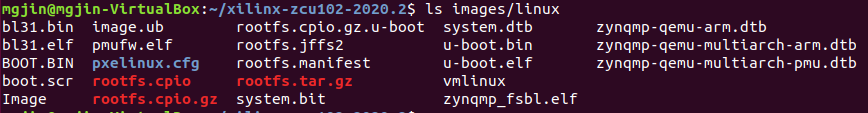

# Zynq + PetaLinux 개발 환경 구축
## 1. 버전 선정 및 VM 생성

### PetaLinux 버전 선정

  * PetaLinux 최신 버전: 2020.2
  * https://www.xilinx.com/support/download/index.html/content/xilinx/en/downloadNav/embedded-design-tools.html

### BSP 종류 선정

  * MYC-CZU3EG는 Xilinx Zynq UltraScale + MPSoC 구조로, 64bit 4-core Cortex
  * PetaLinux 다운로드 페이지 하단의 **Zynq UltraScale+MPSoC BSP (2020.2)**에서 가장 기본 구성인 ZCU102 BSP 사용함
  * https://www.xilinx.com/support/download/index.html/content/xilinx/en/downloadNav/embedded-design-tools.html
  * 추후 단계에서 rootfs를 configuration하여, SSH, gcc 등 추가

### Ubuntu 버전 선정

  * PetaLinux Tools Reference Guide에 따라, PetaLinux 2020.2는 Ubuntu 18.04.4 (64bit)까지 지원함 (Guide p.10)
    https://www.xilinx.com/support/documentation/sw_manuals/xilinx2020_2/ug1144-petalinux-tools-reference-guide.pdf
  * Old Releases에서 Ubuntu 18.04.4 Desktop Amd64 이미지 다운로드
    http://old-releases.ubuntu.com/releases/18.04.4/
  * 속도 문제로 Torrent 권장, Kakao Mirror에는 18.04.5 밖에 없음

### VirtualBox 설치

* VirtualBox Extenstion 설치 (USB 메모리 인식 지원)
* https://blog.thereis.xyz/25

### Ubuntu VM 생성

  * PetaLinux Tools Reference Guide에 따라, 권장 사양 설정
  * 8GB RAM
  * 2GHz CPU (2-core로 진행함)
  * \>100GB HDD (256GB로 진행함)
  * 네트워크 설정 (추후 진행 가능)
    * 네트워크 어댑터 2 추가
    * 어댑터 2는 Zynq랑 연결되는 LAN으로 Bridge Network
    * SSH 등을 사용하기 위해서는 고급 설정에서 포트 포워딩 필요 (22, 23, 80 등)

### VM에 Ubuntu 설치

  * 일단 English 언어/English 키보드 설정 (추후 필요할 시, 한국어로 테스트 필요)
  * Minimal Installation 설치로 진행
  * 설치 완료후 VirtualBox Guest Additions 설치&재부팅 디스플레이 Resolution 최적화 (optional)
  * Bridge Network에 대해서, Static IP 설정
    * Zynq와 같은 대역의 IP, NetMask 설정
    * Ethernet Off and On (Connected 표시 확인)
    * 상호 Ping Test
    * Telnet server 설치 `sudo apt-get install telnetd` (optional)
    * Telnet server 설정 https://gihyun.com/100 및 서버 재실행 (optional)


## 2. PetaLinux 설치

### PetaLinux 및 BSP 다운로드

  * 앞서 버전 선정한 페이지에서 로그인 후 다운로드
  * https://www.xilinx.com/support/download/index.html/content/xilinx/en/downloadNav/embedded-design-tools.html

### PetaLinux 설치 전 환경 세팅 (Terminal로 진행)

#### 기본 Bash 변경

* `ls -al /bin/sh` dash 확인
* `sudo dpkg-reconfigure dash` -> No 선택
* `ls -al /bin/sh` bash로 변경 확인

#### VIM 설정

* https://github.com/amix/vimrc#how-to-install-the-basic-version 사용하여 진행
* `sudo apt install git vim`
* `git clone --depth=1 https://github.com/amix/vimrc.git ~/.vim_runtime`
* `sh ~/.vim_runtime/install_basic_vimrc.sh`
* Installed the Basic Vim configuration successfully 메시지 확인

#### APT 최신화

* Repo Mirror를 Kakao 서버로 변경 (optional)
  * `sudo vi /etc/apt/sources.list`
  * `:%s/kr.archive.ubuntu.com/mirror.kakao.com`
  * `sudo apt-get update`
  * https://seonift.github.io/2019/06/21/Ubuntu-%EA%B8%B0%EB%B3%B8-repo-mirror%EB%A5%BC-kakao-mirror%EB%A1%9C-%EB%B0%94%EA%BE%B8%EA%B8%B0/
* `sudo apt-get update`
* `sudo apt-get upgrade`

#### PetaLinux 설치 요구사항

* `sudo apt-get install xinetd build-essential gawk gcc gcc-multilib git make net-tools libncurses5-dev tftp tftpd-hpa zlib1g:i386 zlib1g-dev libssl-dev flex bison libselinux1 gnupg wget diffstat chrpath socat xterm autoconf libtool tar unzip texinfo libglib2.0-dev screen pax gzip tofrodos iproute2 lib32z1 lib32gomp1 python`
* v2019.1 on Ubuntu 18.04 설치 참고 https://qwoowp.tistory.com/48?category=828922
* v2019.1 on Ubuntu 18.04.2 설치 참고 https://qwoowp.tistory.com/21?category=828922

#### TFTP 설정

* `sudo vi /etc/xinetd.d/tftp`

* ```bash
  service tftp
  {
  	socket_type = dgram
  	protocol = udp
  	wait = yes
  	user = root
  	server = /usr/bin/in.tftpd
  	server_args = -s /tftpboot
  	disable = no
  	per_source = 11
  	cps = 100 2
  	flags = IPv4
  }
  ```

* `sudo mkdir /tftpboot`

* `sudo chmod 777 /tftpboot`

* `sudo /etc/init.d/xinetd restart`

### PetaLinux 설치

 * PetaLinux Installer와 BSP 파일을 User Home으로 이동시킨 후 진행
 * `mkdir -p /home/<user>/petalinux/2020.2`
 * `sudo chmod +x ./petalinux-v2020.2-final-installer.run`
 * `./petalinux-v2020.2-final-installer.run --dir /home/<user>/petalinux/2020.2`
 * License Agreement 3번 진행해야 함 (Enter -> q -> y)


## 3. PetaLinux 빌드

### BSP 이용 프로젝트 생성 Create

* `ls /home/<user>/petalinux/2020.2` settings.sh 파일 확인
* `source /home/<user>/petalinux/2020.2/settings.sh` Environment set 확인
* **WARNING: No tftp server found** 메시지가 나타나지 않는 것을 확인
* `petalinux-create -t project -s xilinx-zcu102-v2020.2-final.bsp`

* https://slayernoone.tistory.com/entry/20163-%EC%84%A4%EC%B9%98

### Kernel Configuration

* `cd xilinx-zcu102-2020.2`
* `petalinux-config -c rootfs` (Guide p.95)
* GUI에서 필요한 package 선택 (Enter로 submenu, Esc Esc로 parent menu)
  * Filesystem Packages
    * admin > sudo > sudo **Y**
    * base > tar > tar **Y**
    * console
      * network
        * curl > curl **Y**
        * dropbear > dropbear **N**
        * openssh
          * openssh **Y**
          * openssh-ssh **Y**
          * openssh-sftp **Y**
          * openssh-sftp-server **Y**
          * openssh-keygen **Y**
          * openssh-sshd **Y**
          * openssh-scp **Y**
        * wget > wget **Y**
      * utils
        * bash-completion > bash-completion **Y**
        * git > git **Y**
        * grep > grep **Y**
        * gzip > gzip **Y**
        * man > man **Y**
        * sed > sed **Y**
        * sysstat > sysstat **Y**
        * unzip > unzip **Y**
        * vim > vim **Y**
        * zip > zip **Y**
    * devel
      * make > make **Y**
    * misc
      * gcc-runtime
        * libstdc++-dev **Y**
        * libstdc++ **Y**
      * hdmi-module > kernel-module-hdmi **Y**
      * net-tools > net-tools **Y**
      * packagegroup-core-buildessential > packagegroup-core-buildessential **Y**
      * packagegroup-core-ssh-dropbear > package-core-ssh-dropbear **N**
  * Petalinux Package Groups
    * packagegroup-petalinux-opencv > packagegroup-petalinux-opencv **Y**
  * Image Features
    * ssh-server-dropbear **N**
    * ssh-server-openssh **Y**
* Save and Exit
* https://velog.io/@juni-test/Petalinux-SSH-%ED%99%9C%EC%84%B1%ED%99%94-%EB%B0%A9%EB%B2%95

### Build System Image

* `petalinux-build` 통해 Device Tree DTB 파일, Boot Loader, U-Boot, Kernel, Root File System 이미지 생성 (Guide p.27)
* `ls images/linux` 또는 `ls /tftpboot` 통해 생성된 파일 확인
  * 

### Build Boot Image

* `petalinux-package --boot --u-boot --format BIN` BOOT.bin 파일 생성 (Guide p.30 하단)
* 

### SD Card에 복사

* VirtualBox에서 USB 사용 및 장치 연결
* SD Card Partitioning and Formatting (Guide p.209)
  * `sudo fdisk /dev/sdb`
    * Partioning 작업
  * `sudo mkfs.vfat /dev/sdb1`
  * `sudo mkfs.ext4 /dev/sdb2`

* SD Card FAT에 복사 (Guide p.60, p.108)
  * `gunzip rootfs.tar.gz`
  * `sudo cp rootfs.tar`
  * `sudo cp xilinx-zcu102-2020.2/images/linux/rootfs.tar.gz /media/<user>/<FAT>`
* RamDisk로 부팅 후 복사
  * Switch: off/on/off/on
  * Login with root/root
  * `/updatesys.sh /mnt/mmcblk1p1`
* eMMC로 부팅 후 확인
  * Switch: on/off/on/on
  * login
  * `ifconfig eth0 192.168.1.122 up`로 Static IP 세팅


## 4. Cross Compilation 환경 설치

### Xubuntu 18.04 + VS Code 참조

* https://rottk.tistory.com/entry/CC-%EA%B0%9C%EB%B0%9C%ED%99%98%EA%B2%BD-%EC%84%A4%EC%A0%95-Xubuntu-1804

